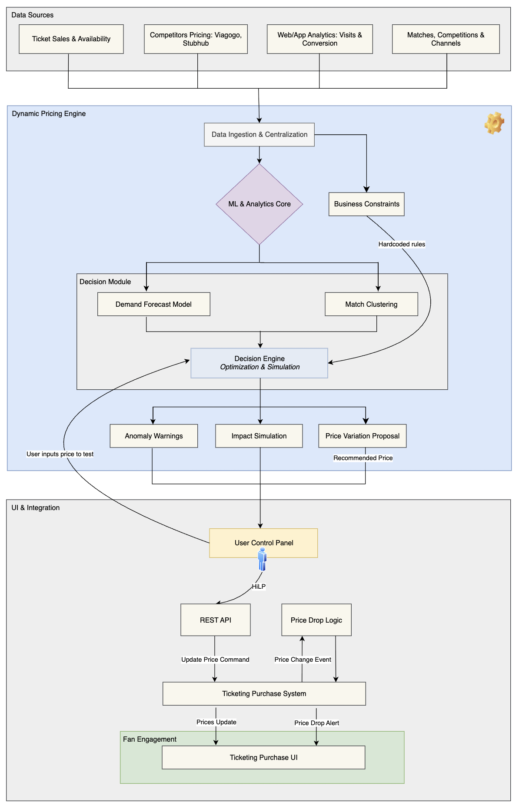

# 💹 FCB_Dynamic-Pricing

<p align="left">
  
  
</p>

> A dynamic pricing and decision support system for football match tickets. **Objective:** To evolve a manual price-decision process into a data-driven, semi-automated workflow that improves revenue and sales.

### Outline

- [Key Results](#key-results)
- [Overview](#overview)
- [Architecture](#architecture)
- [Modeling](#modeling)
- [Structure](#structure)
- [Usage](#usage)

---

## Key Results

| Metric                      | Result                               | Description |
| :-------------------------- | :----------------------------------- | :----------------------------------- |
| 📈 Revenue Uplift           | **+6%** Average Revenue per Match    | Achieved by dynamically adjusting prices to match real-time demand forecasts, capturing more value from high-demand matches. Validated via controlled A/B testing.|
| 🎟️ Optimized Sales          | **+4%** Increase in Ticket Sell-Through Rate | A direct result of modeling price elasticity. Didn't maximize revenue at the cost of empty seats; also improved occupancy, which affects atmosphere and in-stadium sales.|
| ⚙️ Operational Efficiency   | **7x improvement** in Time-to-Price-Change | From weekly to daily changes by automating the manual data aggregation and analysis pipeline. The system delivers price recommendations directly, shifting the team's focus from data work to strategic approval.|
| 🤝 Recommendation Adoption | **91%** of Proposals Approved | Measures the percentage of automated price proposals that were reviewed and approved by the commercial team, indicating trust in the model's business alignment.|
| 🎯 Demand Forecast Accuracy | **14%** Weighted Avg. % Error | The demand forecast model's predictions have a low average error rate, indicating that sales predictions are reliable.|

## Overview

The diagram below illustrates the project's conceptual framework. The system acts as the central "brain" to balance the goals of The Club and The Fan. It operates in a continuous loop by ingesting internal data (like seat availability) and external factors (like social media buzz) to forecast demand at various price points. The **Decision Engine** then uses this forecast to recommend an optimal price. This transforms a static, manual pricing strategy into a responsive, automated system with a human-in-the-loop (HiTL), creating a market-driven approach for both setting and responding to ticket prices.

<p align="center">
  
  <br>
  <em>Fig. 1: A high-level diagram of the Dynamic Pricing Engine.</em>
</p>

The core challenge was to move from a rigid, manual pricing strategy to a data-driven, automated one. The table below summarizes the problem–solution mapping.

| 🚩 The Problem | 💡 The Solution |
| :--------------------------- | :---------------------------- |
| **Static pricing**: Prices were set once per season in rigid, inflexible categories (e.g., A++, A, B). | **Dynamic recommendations**: Generates price proposals for each seating zone based on real-time data analysis. |
| **Manual adjustments**: The team would slowly analyze various metrics to manually propose price changes. | **Impact simulation**: Instantly models the projected impact of any price change on revenue and ticket sales. |
| **Data bottleneck**: Extracting data manually from fragmented systems was slow and operationally complex. | **Centralized data**: Automatically aggregates all key data points—sales, web analytics, contextual data, etc.—into one place. |
| **Slow implementation**: The process to act on a decision was manual and disconnected from the sales platform. | **Seamless integration**: Allows for one-click approval on a dashboard, which triggers a price update to the live ticketing system via REST API. |


## Architecture

The general workflow is as follows:
1. **Data Sources** are collected and fed into the central engine.
2. The **Dynamic Pricing Engine** uses machine learning models and business rules to generate a price recommendation.
3. The pricing team uses the **UI & Integration** layer to review, simulate, and approve the price, which is then updated in the live ticketing system.

<p align="center">
  
    <br>
  <em>Fig. 2: The low-level architecture diagram.</em>
</p>

<details>
<summary><b>Click to see the detailed architecture breakdown</b></summary>

### 1. Data Sources

| Component | Description |
| :--- | :--- |
| **Ticket Sales & Availability** | Historical and real-time data on ticket inventory, sales velocity, and transactions. |
| **Competitors Pricing** | Scraped pricing data from secondary markets (e.g., Viagogo, Stubhub) for competitive analysis. |
| **Web/App Analytics** | Data on user behavior from the official website and app, including page visits, clicks, and conversion funnels. |
| **Matches, Competitions & Channels** | Foundational information about each match, including opponent, date, competition type, and sales channel. |

### 2. Dynamic Pricing Engine

| Component | Description |
| :--- | :--- |
| **Data Ingestion & Centralization** | The entry point that gathers data from all sources and consolidates it into a unified data store for processing. |
| **ML & Analytics Core** | The central "brain" where data is processed, features are engineered, and the machine learning models are trained and executed. |
| **Business Constraints** | A module containing hardcoded business logic (e.g., price floors/caps) that provides rules directly to the Decision Engine to ensure recommendations are compliant with club strategy. |
| **Decision Module** | A container for the core predictive models that feed the optimization engine. |
| ┣ **Price Elasticity Model** | A model that calculates how sensitive ticket demand is to changes in price. |
| ┣ **Demand Forecast Model** | A model that predicts the expected volume of ticket sales at various price points. |
| ┣ **Match Clustering** | An algorithm that groups similar matches together (e.g., "Weekday league match vs. mid-tier team") to improve model accuracy. |
| **Decision Engine: Optimization & Simulation** | Takes the outputs from the Decision Module and Business Constraints to find the revenue-maximizing price. It also allows for "what-if" simulations. |
| **Anomaly Warnings** | An alerting system that flags unusual sales patterns or pricing recommendations that deviate from norms. |
| **Impact Simulation** | A feature that allows a human user to test a hypothetical price and see the model's prediction for its impact on sales and revenue. |
| **Price Variation Proposal** | The final output of the engine: a concrete price recommendation for a given seat or section. |

### 3. UI & Integration

| Component | Description |
| :--- | :--- |
| **User Control Panel** | The dashboard used by the pricing team to view price proposals, run impact simulations, and approve or reject changes, enabling Human-in-the-Loop (HITL) control. |
| **REST API** | The communication layer that allows the User Control Panel to send approved price change commands to the live ticketing system. |
| **Price Drop Logic** | An automated module that can trigger price change events based on predefined rules, such as slow ticket sales. |
| **Ticketing Purchase System** | The club's main backend system that processes transactions and manages ticket inventory. It receives price update commands from the API. |
| **Fan Engagement** | The final layer where fans interact with the system's output. |
| ┗ **Ticketing Purchase UI** | The public-facing website or application screen where fans see the dynamically adjusted prices and make their purchases. |

</details>

## Modeling

With data in hand, proceed to train the model. This phase includes selecting and training the model and conducting error analysis.

- Select and train a model using the prepared dataset.
- Conduct error analysis to identify improvement areas.
- Iterate on model architecture, hyper-parameters, or data as needed.
  
The modeling strategy followed a two-stage process: first *predict*, then *optimize*. The system first forecasts demand with high accuracy and then uses that forecast within a Decision Engine to find the optimal price.

### Stage 1: 📈 Demand Forecasting

This stage answers the question: *"At a given price, how many tickets are we likely to sell?"*

| Aspect         | Description                                                                                                                                                                             |
| :------------- | :-------------------------------------------------------------------------------------------------------------------------------------------------------------------------------------- |
| **Model** | A `GradientBoostingRegressor` forecasts ticket demand (`zone_historical_sales`) for each match.                                                                                           |
| **Rationale** | Gradient Boosting excels at handling the complex, non-linear relationships discovered during EDA and is robust against outliers, making it a strong choice for this task.                  |
| **Features** | The model uses a rich set of internal and external factors, including historical sales, opponent tier, social media sentiment, and the `ticket_price` itself to learn price elasticity. |
| **Application**| This trained model powers the **Simulation Engine**, allowing the commercial team to perform "what-if" analysis by inputting a hypothetical price and instantly seeing the likely impact on revenue and sales. |
| **Design Choice**| While `XGBoost` or `LightGBM` are often faster and would probably provide a performance edge, the choice of scikit-learn's `GradientBoostingRegressor`, because of the synthetic dataset size, the difference would be negligible. |

<details>
<summary><b>Click to see the detailed model performance evaluation</b></summary>

The primary goal is to accurately predict ticket sales. Performance was evaluated against a **baseline model** (`DummyRegressor`) to ensure the model was genuinely learning. The key metric chosen was **WAPE**, as it provides a clear, interpretable measure of percentage error that resonates with business stakeholders.

| Metric                        | Value           | Description & Rationale                                                                                                                                                                                              |
| :---------------------------- | :-------------- | :----------------------------------------------------------------------------------------------------------------------------------------------------------------------------------------------------------------- |
| **WAPE** (Primary Metric) | **14%** | **Why we chose it:** Weighted Absolute Percentage Error is the most critical metric for this business case. It tells us the average forecast error in percentage terms, making it highly interpretable for revenue planning. A low WAPE is our main goal. |
| **R² Score** | **0.86** | **For model fit:** This shows that the model explains 86% of the variance in ticket sales, confirming it has a strong statistical fit to the data and learns the underlying patterns effectively.                                |
| **Mean Absolute Error (MAE)** | **~254 tickets**| **For business context:** MAE tells us that, on average, our forecast is off by about 254 tickets. This gives stakeholders a concrete sense of the error margin in absolute units.                                      |
| **Root Mean Squared Error (RMSE)**| **~312 tickets**| **For robustness:** RMSE penalizes larger errors more heavily. A higher RMSE relative to MAE suggests the model occasionally makes larger prediction errors, which is useful information for risk assessment.             |

The performance was considered *successful*. A WAPE of 14% and an R² of 0.86 demonstrated a robust and reliable forecasting engine.

</details>

### Stage 2: ⚙️ Price Optimization

This stage answers the business question: *"What is the single best price to maximize total revenue?"*

| Aspect         | Description                                                                                                                                                                                          |
| :------------- | :--------------------------------------------------------------------------------------------------------------------------------------------------------------------------------------------------- |
| **Model** | A custom **Optimization Engine** performs an exhaustive grid search over a range of valid prices.                                                                                                        |
| **Rationale** | A grid search is a reliable and straightforward method to find the optimal price within defined business constraints (e.g., price caps and floors). It guarantees finding the maximum projected revenue. |
| **Process** | The engine iterates through potential prices (e.g., from €75 to €350), uses the demand model to predict sales for each, calculates the projected revenue (Price × Predicted Sales), and returns the optimal price. |
| **Output** | The engine's primary output is the official `Price Variation Proposal`, which is sent to the commercial team for review and approval.                                                                   |
| **Design Choice**| Bayesian Optimization would likely find a near-optimal price much faster by intelligently exploring the price space. However, it doesn't guarantee finding the absolute maximum. Guaranteeing the optimal recommendation (within the model's predictive power) is often more valuable than the computational speed gained from a heuristic approach. |

<details>
<summary><b>Click to see the detailed model performance evaluation</b></summary>

Since this is an optimization engine, not a predictive model, its performance is measured by its business value and efficiency.

| Metric            | How We Measure It                                                                                              | Success Criteria                                                                                        |
| :---------------- | :------------------------------------------------------------------------------------------------------------- | :------------------------------------------------------------------------------------------------------ |
| **Revenue Lift** | Through A/B testing (simulated or live), comparing the revenue generated by the engine's prices against a control group (e.g., prices set manually or by a simpler heuristic). | A consistent, statistically significant increase in average revenue per match.                               |
| **Adoption Rate** | Tracking the percentage of `Price Variation Proposals` that are reviewed and approved by the commercial team.    | A high adoption rate (>80%) indicates that the team trusts and values the engine's recommendations.         |
| **Computation Time**| Measuring the wall-clock time it takes for the grid search to complete for a given match.                       | The time must be within acceptable operational limits (e.g., under 1 minute) to allow for rapid, on-demand analysis by the commercial team. |

</details>

### Feature Engineering

The model's accuracy is heavily dependent on a rich feature set combining internal and external data.

* **🏠 Internal factors**: one, two, three
* **🌍 External factors**: four, five, six

A key part of the modeling strategy was to move beyond our internal sales history by enriching our models with external data. Through feature engineering, we combined our own historical performance data with real-world market signals—like opponent rankings and social media hype—to create a more holistic and predictive view of market dynamics.

<details>
<summary><b>Click to see the detailed list of features</b></summary>

Each row in the synthetic dataset (`synthetic_match_data.csv`) represents the state of a specific seating **zone** for a single **match** at a particular point in time, defined by the `days_until_match`. The primary goal is to predict the `ticket_price` based on the other features.

### Identifiers & Categorical Features

| Feature Name | Data Type | Description |
| :--- | :--- | :--- |
| `match_id` | Integer | A unique identifier for each football match. |
| `zone` | String | The name of the seating zone in the stadium (e.g., 'Gol Nord', 'Lateral', 'VIP'). |
| `opponent_tier` | String | A categorical rating of the opponent's quality and appeal (`A++`, `A`, `B`, `C`). Higher tiers signify more attractive matches, influencing demand. |
| `weather_forecast` | String | The predicted weather for the match day ('Sunny', 'Cloudy', 'Rain'). Can influence last-minute purchase decisions. |
| `competing_city_events` | Boolean | `True` if there are other major events (concerts, festivals) in the city on the same day, which could reduce local demand. `False` otherwise. |

### Time-Based & Demand Signals

These features capture the dynamics of demand over time and external market interest.

| Feature Name | Data Type | Description |
| :--- | :--- | :--- |
| `days_until_match` | Integer | The number of days remaining before the match. A key feature for time-series analysis, as demand typically increases as the match date approaches. |
| `flights_to_barcelona_index`| Integer | A synthetic index (scaled 20-100) representing the volume of inbound flights to the city. This serves as a proxy for tourist demand. |
| `google_trends_index` | Integer | A synthetic index (scaled 20-100) representing public search interest for the match on Google. A proxy for general public interest and hype. |
| `internal_search_trends`| Integer | A synthetic count of searches for the match on the club's own website or app. A direct signal of purchase intent from the user base. |
| `web_visits` | Integer | A synthetic count of visits to the ticketing section of the club's official website. A measure of online traffic and interest. |
| `web_conversion_rate` | Float | The synthetic conversion rate on the website (ticket purchases / visits). A measure of how effectively web traffic is converting into sales. |
| `social_media_sentiment`| Float | A synthetic score representing the overall public sentiment (e.g., from -1.0 for very negative to +1.0 for very positive) about the match on social media platforms. |

### Sales, Availability & Pricing

| Feature Name | Data Type | Description |
| :--- | :--- | :--- |
| **`zone_historical_sales`** | **Integer** | **(Target Variable)** The historical number of tickets sold for a similar match in that zone. This is the *primary target variable* for the demand forecast model. |
| `zone_seats_availability` | Integer | The absolute number of seats still available for purchase in that zone. |
| `ticket_availability_pct` | Float | The percentage of total seats in the zone that are still available. |
| `competitor_avg_price` | Float | The average ticket price for a comparable entertainment event (e.g., another major football match, a concert) on the same day. Represents the competitive landscape. |
| `ticket_price` | Float | The price of the ticket. This is a *key input* feature for the demand model and the *final output* of the optimization engine. |

</details>

> **Notes on Deployment**
> - *Validation*: Before a full rollout, the system was rigorously validated through controlled A/B tests. The new dynamic pricing model was applied to a few sections of the stadium, with the rest serving as a control group. This allowed us to scientifically prove the model's positive impact on revenue and sales.
> - *Rollout*: The entire system was deployed within an automated MLOps pipeline. This ensures models are automatically retrained on new data, performance is constantly monitored, and price recommendations are reliably fed to the Control Panel. All models were designed for batch prediction, running on a daily schedule to balance cost and timeliness.

## Structure

```
FCB_Dynamic-Pricing/
├── .gitignore                       # Specifies files for Git to ignore.
├── LICENSE                          # Project license (MIT).
├── README.md                        # An overview of the project. <-- YOU ARE HERE
├── requirements.txt                 # The requirements file for reproducing the analysis.
├── config.py                        # Configuration file for paths, parameters, etc.
├── assets/                          # Contains images and diagrams for the README.
├── data/                            # Stores data related to the project.
│   ├── 01_raw/                      # The original, immutable data.
│   └── 02_processed/                # Processed and cleaned data ready for modeling.
├── models/                          # Stores trained model artifacts.
├── notebooks/                       # Jupyter notebooks for analysis and experimentation.
│   └── eda.ipynb                    # Exploratory Data Analysis notebook.
├── reports/                         # Contains explanatory documents.
└── src/                             # Source code for the project.
    ├── __init__.py                  # Makes src a Python package.
    ├── data/                        # Scripts for data ingestion and processing.
    │   └── make_dataset.py          # Script to generate the synthetic dataset.
    └── features/                    # Scripts for feature engineering.
    │    └── build_features.py       # Script to process data into model-ready features. 
    ├── models/                      # Scripts for model training and prediction.
    │   ├── train_demand_model.py    # Script to train the demand prediction model.
    │   └── predict_demand.py        # Script to get a sample demand prediction.
    └── decision_engine/             # Scripts for simulation and optimization.
        ├── simulate.py              # Script to run a what-if simulation.
        └── optimize.py              # Script to find the optimal price.

```

## Usage

### 🚀 Running the Pipeline

To run the project and see the full pipeline in action, follow these steps from your terminal.

1. **Set up the environment** (only needed once):
    ```bash
    pip install -r requirements.txt
    ```

2. **Generate the dataset:**
    ```bash
    python -m src.data.make_dataset
    ```

3. **Process features for modeling:**
    ```bash
    python -m src.features.build_features
    ```

4. **Run the training pipeline:**
    ```bash
    python -m src.models.train_demand_model
    ```

5. **Run the Decision Engine scripts:**
    ```bash
    # Get a "what-if" analysis for a specific price
    python -m src.decision_engine.simulate

    # Get a revenue-optimal price recommendation
    python -m src.decision_engine.optimize
    ```

</br>

> ⚠️ **Project Disclaimer:**
>
> * **Illustrative purpose:** This repository serves as a high-level demonstration of the project's architecture and methodology. Many implementation details and model complexities have been simplified for clarity.
> * **Synthetic data:** The code runs on synthetic data, as the original data is proprietary and cannot be shared. The purpose is to demonstrate the modeling approach and engineering best practices of the real-world project.

</br>

<p align="center">🌐 © 2025 t.r.</p>
