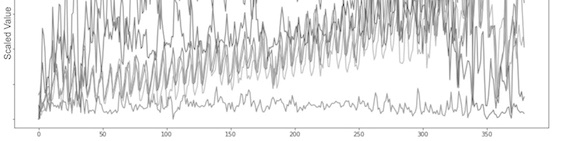
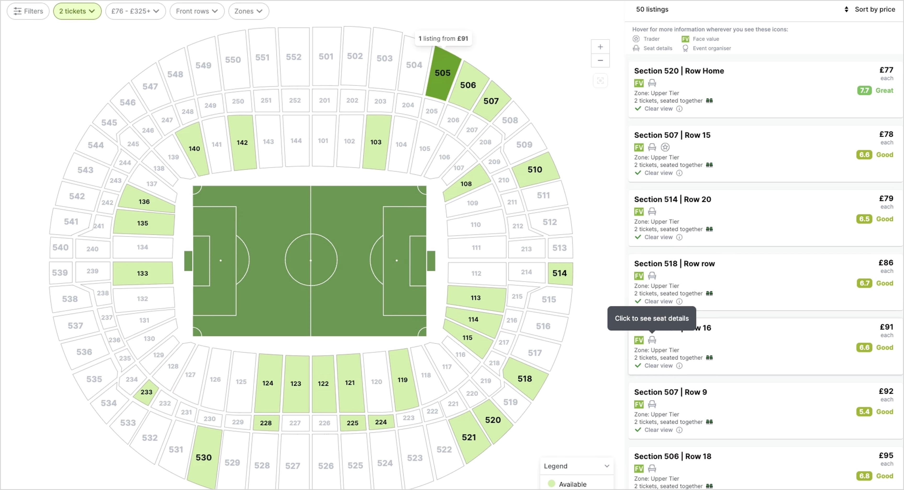
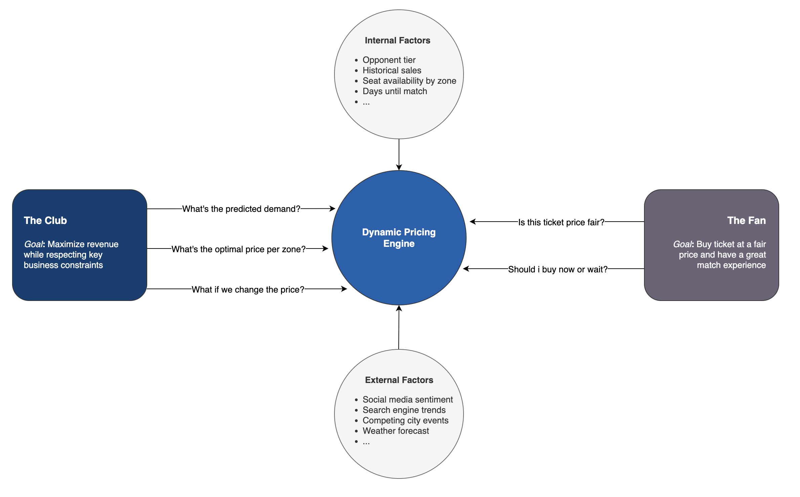
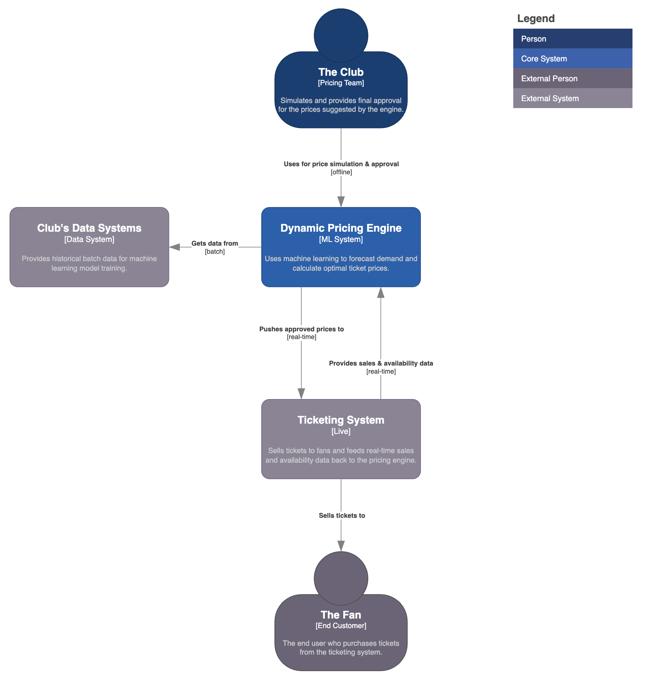
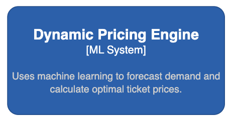

# Dynamic Pricing Engine with Human-in-the-loop

<p align="left">
  
  
</p>

> An ML-powered dynamic pricing and decision support system for tickets pricing in a sports stadium. 
> **Objective:** To evolve a manual price-decision process into a data-driven, semi-automated workflow that improves ticketing revenue and sales.

### Outline

- [Key Results](#key-results)
- [Overview](#overview)
- [Architecture](#architecture)
- [Dataset](#dataset)
- [Modeling](#modeling)
- [Structure](#structure)

---

## Key Results

| Metric                      | Result                               | Description |
| :-------------------------- | :----------------------------------- | :----------------------------------- |
| 📈 Revenue Uplift           | **+6%** Average Revenue per Match    | Achieved by dynamically adjusting prices to match real-time demand forecasts, capturing more value from high-demand periods. This was powered by accurate supply predictions from the `seat availability engine` [](https://github.com/tomas-ravalli/fcb-smartbooking) |
| 🎟️ Optimized Sales          | **+4%** Increase in Ticket Sell-Through Rate | Didn't maximize revenue at the cost of empty seats: also improved occupancy, which positively affects atmosphere and in-stadium sales.|
| ⚙️ Operational Efficiency   | **7x improvement** in Time-to-Price-Change | From weekly to daily changes by automating the manual data aggregation and analysis pipeline. The system delivered price recommendations directly, which shifted the team's focus from data work to strategic approval.|
| 🤝 Recommendation Adoption | **86%** of Proposals Approved | Percentage of automated price proposals that were reviewed and approved by the commercial team, indicating trust in the model's business alignment.|
| 🎯 Demand Forecast Accuracy | **19%** WAPE | The model's predictions had a low average error, performed 60% better than a baseline `DummyRegressor`, indicating that sales forecasts are reliable.|


## Overview

The main challenge was to transform a static, manual pricing strategy into a responsive, automated system with a human-in-the-loop (HiTL), creating a market-driven approach for both setting and responding to ticket prices per match.

<p align="center">
  
  <br>
  <em>Fig. 1: A standard stadium ticket pricing by zone during checkout process.</em>
</p>

To illustrate how the system directly addresses key business challenges, the following table maps each identified pain point to its corresponding solution:

| 🚩 The Problem | 💡 The Solution |
| :--------------------------- | :---------------------------- |
| **Static pricing**: Prices were set once per season in rigid, inflexible categories (e.g., A++, A, B), then updated weekly/monthly. | **Dynamic recommendations**: Generates price proposals for each seating zone based on near real-time data analysis, allowing for daily updates. |
| **Manual adjustments**: The team would slowly analyze various metrics to manually propose price changes. | **Impact simulation**: Instantly models the projected impact of any price change on revenue and ticket sales. |
| **Data bottleneck**: Extracting data manually from fragmented systems was slow and operationally complex. | **Centralized data**: Automatically aggregates all key data points –sales, web analytics, contextual data, etc.– into one place. |
| **Slow implementation**: The process to act on a decision was manual and disconnected from the sales platform. | **Seamless integration**: Allows for one-click approval on a dashboard, which triggers a price update to the live ticketing system via REST API. |

The diagram below illustrates the project's conceptual framework. The system acts as the central *brain* to balance the goals of The Club and The Fan. It operates in a continuous loop by ingesting internal and external factors to forecast demand at various price points. The **Decision Engine** then uses this forecast to recommend an optimal price.

<p align="center">
  
  <br>
  <em>Fig. 2: A high-level diagram of the system's market dynamics.</em>
</p>


## Architecture

<p align="center">
  
  <br>
  <em>Fig. 3: [System Context Diagram] Dynamic Pricing System</em>
</p>

### System Synergy
This Dynamic Pricing Engine is designed to work in tandem with the **[Seat Availability Engine](https://github.com/tomas-ravalli/fcb-smartbooking)**. The pricing model's effectiveness depends on knowing not just the current ticket availability, but the **final forecasted supply**. The Seat Availability Engine provides this crucial input, allowing this system to set prices based on a true understanding of the market's supply-demand curve.


## Dataset

To showcase the model's capabilities, this repository uses a synthetically generated dataset. This dataset is not random data; it is engineered to mirror the complexity, scale, and statistical properties of a real-world ticketing environment for a top-tier football club.

The dataset simulates:

* **A focused set of matches:** It contains data for **10 unique matches**, representing a diverse sample of fixtures including league, cup, and international games.
* **Complete sales history:** For each of these matches, a full **90-day time-series** is generated. This means there is a daily record capturing how demand signals, sales, and availability evolve from the day tickets go on sale until match day.
* **Zone-level granularity:** Each daily record is further broken down by **5 distinct seating zones**, each with its own capacity and base price, reflecting how different stadium areas have unique demand curves.

A key part of the strategy was to move beyond our internal sales history by enriching our models with external data. Through feature engineering, we combined our own historical performance data with real-world market signals—like opponent rankings and social media hype—to create a more holistic and predictive view of market dynamics, resulting in a feature set combining **internal and external** data.

The model's features are grouped to provide a comprehensive view of factors influencing ticket demand.

| Category | Features | Description |
| :--- | :--- | :--- |
| **Match & Opponent** | `match_id`, `days_until_match`, `is_weekday`, `opponent_tier`, `ea_opponent_strength`, 'international_competition' | Core details about the match, its timing, and opponent quality. |
| **Team Status** | `team_position`, `top_player_injured`, `league_winner_known` | Captures the team's current performance, player status, and league context. |
| **Ticket & Zone** | `seat_zone`, `ticket_price`, `ticket_availability_pct`, `zone_seats_availability` | Attributes related to the specific ticket and seating area. |
| **Demand & Hype** | `internal_search_trends`, `google_trends_index`, `social_media_sentiment`, `web_visits`, `web_conversion_rate` | Digital signals measuring public interest and purchase intent. |
| **External Factors**| `is_holiday`, `popular_concert_in_city`, `competitor_avg_price`, `flights_to_barcelona_index` | External events, competition, and tourism proxies that affect demand. |
| **Weather** | `weather_forecast` | Forecasted weather conditions for the match day. |

> **`zone_historical_sales`** [Target Variable]: The historical number of tickets sold for a similar match in that specific zone. This is the value the model aims to predict.

### Match Excitement Factor

To create a realistic dataset, the generation script doesn't just create random numbers. Instead, it simulates the underlying market dynamics by creating a unified **"Match Excitement Factor"**. This single variable acts as the primary driver for most of the demand signals in the dataset.

The logic is designed to mimic how a real fan's interest level would change based on the context of a match:

1.  **Starts with the opponent:** The excitement level begins with the quality of the opponent (`opponent_tier`). A top-tier opponent naturally generates more interest.

2.  **Adjusts for context:** The base excitement is then adjusted up or down based on several real-world factors:
    * **League position:** Excitement increases slightly if the team is high in the league standings.
    * **Player injuries:** Excitement decreases significantly if a star player is injured, especially for a high-profile match.
    * **Match importance:** Excitement drops for less meaningful matches, such as when the league winner is already known.
    * **Holidays & weekdays:** Matches near holidays get a boost in excitement, while weekday matches see a slight decrease.

3.  **Drives demand signals:** The final "Match Excitement Factor" is then used to generate all the other demand signals. For example, a match with a high excitement score will also have higher `google_trends_index`, more positive `social_media_sentiment`, and more `internal_search_trends`.


## Modeling

The goal is not just to build a black-box forecasting model, but to solve a formal business problem. At its core, this project can be framed as a **constrained optimization problem**: we want to find the optimal set of prices to maximize profit, subject to real-world business constraints.

The objective is to maximize the total profit ($Z$) for a given match, defined as:
```math
\max Z = \underbrace{\sum_{j=1}^{n} (p_j \cdot S_j)}_{\text{Ticket Revenue}} + \underbrace{(\bar{m} \cdot \sum_{j=1}^{n} S_j)}_{\text{In-Stadium Spend}} - \underbrace{C_{op}}_{\text{Operational Costs}}
```
Where the terms in the equation are defined as:

* **$n$** is the number of distinct seating zones.
* **$p_j$** is the ticket price for zone *j*. This is the **decision variable**–the set of values we are solving for.
* **$S_j$** is the number of tickets sold in zone *j* at price $p_j$. This is an outcome predicted by the demand model, where $S_j = f(p_j, \mathbf{X})$.
* **$\mathbf{X}$** is the vector of features for the match (e.g., opponent tier, days until match).
* **$\bar{m}$** is the average in-stadium spend per attendee, estimated from historical data.
* **$C_{op}$** is the total operational cost for staging the match.

This maximization is subject to several key **constraints**:

1.  **Demand**: The number of tickets sold ($S_j$) in each zone is a function of its price ($p_j$) and other market factors ($\mathbf{X}$), as predicted by our machine learning model.
```math
S_j = f(p_j, \mathbf{X})
```

3.  **Capacity**: We cannot sell more tickets than the number of seats available ($C_j$) in each zone.
```math
S_j \le C_j
```

4.  **Occupancy**: To protect brand image and comply with broadcast agreements, the primary seating zone visible on TV ($j_{tv}$) must have at least 85% occupancy.
```math
S_{j_{tv}} \ge 0.85 \cdot C_{j_{tv}}
```

This framework translates the business challenge into a clear mathematical problem. Our two-stage process–first **predict** demand ($S_j$), then **optimize** for price ($p_j$)–is a direct approach to solving it.

<p align="left">
  
  <br>
  <em>Fig. 4: Dynamic Pricing Engine component.</em>
</p>

### Stage 1: 📈 Demand Forecasting

This stage answers the business question: *"At a given price, how many tickets are we likely to sell?"*

| Aspect | Description |
| :--- | :--- |
| **Model** | A hybrid **ensemble model** that combines `Prophet` and `XGBoost` in a residual fitting approach. |
| **Rationale** | This two-step model leverages the strengths of both algorithms. **Prophet** first models the core time-series components (trend, seasonality, and match-day effects). **XGBoost** then models the remaining variance (the residuals) using a rich feature set, capturing complex interactions that Prophet cannot. |
| **Features** | The model uses a rich set of internal and external factors–including historical sales, opponent tier, social media sentiment, and other engineered features–to build a comprehensive **"driver tree"** that explains demand. |
| **Application** | This trained model powers the *Impact Simulation* feature, allowing the commercial team to perform "what-if" analysis by inputting a hypothetical price and instantly seeing the likely impact on revenue and sales. |
| **Design Choice** | A hybrid model was chosen after testing multiple approaches, as the optimal forecasting method is never known beforehand. This ensemble was selected for its superior accuracy; it combines Prophet's strength in modeling core time-series trends with XGBoost's power to capture the remaining complex patterns, leading to a lower overall error. |
| **Production Trade-offs** | The chosen model provides the best balance between **prediction accuracy**, **serving speed** (latency), and **inference cost**, ensuring strong performance in a live environment. |

<details>
<summary><b>Click to see the detailed model performance evaluation</b></summary>
  
</br>

To ensure the final pricing decision is effective, the underlying demand forecast must be highly accurate. The primary goal was to minimize prediction error, evaluated against a **baseline model** (`DummyRegressor`). The key metric chosen was **WAPE**, as it provides a clear, interpretable measure of percentage error.

Determining the best forecasting method is only one half of the equation. We also need to estimate **prediction intervals**–the upper and lower forecast values that the actual value is expected to fall between with a high probability. Prediction intervals are a function of how much data we have, the variation in that data, the forecast horizon, and the chosen model. They are crucial for risk assessment.

As this project uses a hybrid ensemble model, performance is evaluated on the **final, combined forecast**. The system first generates a baseline forecast with `Prophet`, then uses `XGBoost` to predict the remaining error (residuals). The final prediction (`Prophet forecast + XGBoost error forecast`) is then compared against the actual historical sales to derive the metrics below.

| Metric | Value | Rationale |
| :--- | :--- | :--- |
| **WAPE** (Primary Metric) | **19%** | **Why we chose it:** Weighted Absolute Percentage Error tells us the average forecast error in percentage terms, making it highly interpretable for revenue planning. A low WAPE is our main goal. |
| **R² Score** | **0.83** | **For model fit:** This shows that the model explains 83% of the variance in ticket sales, confirming it has a strong statistical fit to the data and learns the underlying patterns effectively. |
| **Mean Absolute Error (MAE)** | **~254 tickets**| **For business context:** MAE tells us that, on average, our forecast is off by about 254 tickets. This gives stakeholders a concrete sense of the error margin in absolute units. |
| **Root Mean Squared Error (RMSE)**| **~312 tickets**| **For robustness & uncertainty:** RMSE penalizes larger errors more heavily. A higher RMSE relative to MAE suggests the model occasionally makes larger prediction errors. This is critical for risk assessment and for estimating **prediction intervals** to understand the forecast's range of uncertainty. |

The performance was considered **successful**. A WAPE of 19% and an R² of 0.83 demonstrated a robust and reliable forecasting engine.

</details>

### Stage 2: ⚙️ Price Optimization

This stage answers the business question: *"What is the single best price to maximize total revenue?"*

| Aspect | Description |
| :--- | :--- |
| **Model** | A custom *Optimization Engine* that performs an exhaustive grid search over a range of valid prices. |
| **Rationale** | A grid search is a reliable and straightforward method to find the optimal price within defined business constraints (e.g., price caps and floors). It guarantees finding the maximum projected revenue. |
| **Process** | The engine iterates through potential prices (e.g., from €75 to €350), uses the demand model to predict sales for each, calculates the projected revenue `(Price × Predicted Sales)`, and returns the optimal price. |
| **Output** | The engine's primary output is the official `Price Variation Proposal`, which is sent to the commercial team for review and approval. |
| **Design Choice**| Bayesian Optimization would likely find a near-optimal price much faster by intelligently exploring the price space. However, it doesn't guarantee finding the absolute maximum. For a critical business decision like pricing, **guaranteeing the optimal recommendation** (within the model's predictive power) is often more valuable than the computational speed gained from a heuristic approach. |

The model's recommendation and the team's pricing policy don't compete; they coexist in a layered system where one empowers the other. The optimization engine provides the **data-driven baseline**, while the pricing team applies the **strategic overlay**. This human-in-the-loop system is powerful because it lets each part do what it does best. The model handles the complex data analysis that would be impossible for a human, while the team focuses on high-level strategy and managing the exceptions and rules that define their business.

Here’s a breakdown of how the two parts work together, using a "hype bonus" policy as an example:

1.  **The optimization engine's role: the baseline price**
    The model's job is to do the heavy lifting. It analyzes all the complex data–historical sales, opponent strength, web traffic, weather forecasts, and the predicted supply of seats–to answer one question: *"Based purely on the data and our profit-maximization goal, what is the single best price?"* This result is the unbiased, mathematically optimal starting point.

2.  **The pricing team's role: the business rule layer**
    The pricing team's job is to apply strategy, context, and rules that may not be captured in the model's data. For example, a policy might be: *"For high-demand games, we have a 'hype' policy. We will add a 5% premium to the initial price to capture the value from early enthusiasts."*

The final workflow looks like this:

* **Input:** A high-demand match is coming up.
* **Engine recommendation:** The optimization engine runs and recommends a price of, say, €150.
* **Apply business rules:** The pricing team sees the recommendation and their system flags it as a "high-demand game," automatically applying the "hype bonus" policy.
* **Final price:** The price that goes live is `€150 + 5%` = **€157.50**.

<details>
<summary><b>Click to see the detailed model performance evaluation</b></summary>
  
</br>

Since this is an optimization engine, not a predictive model, its performance is measured by its business value and efficiency.

| Metric | Measurement | Success Criteria |
| :--- | :--- | :--- |
| **Revenue lift** | Through A/B testing, comparing the revenue generated by the engine's prices against a control group. | A consistent, statistically significant increase in average revenue per match. |
| **Adoption rate** | Tracking the percentage of `Price Variation Proposals` that are reviewed and approved by the commercial team. | A high adoption rate (>80%) indicates that the team trusts and values the engine's recommendations. |
| **Computation time**| Measuring the time it takes for the grid search to complete for a given match. | The time must be within acceptable operational limits (<2') to allow for rapid, on-demand analysis by the commercial team. |

</details>

### Validation

Before a full rollout, the system was rigorously validated through a series of controlled **A/B tests** to scientifically measure its impact and mitigate risk. The core principle was to isolate the effect of the dynamic pricing engine from all other market variables. 

The results from the A/B tests confirmed our hypothesis, showing a consistent **+6% lift in average revenue** for the treatment group. Additionaly, this was achieved while also increasing the sell-through rate, demonstrating that the model was effective at finding the true market equilibrium. These conclusive, data-backed results gave the business full confidence to proceed with a full-scale rollout of the dynamic pricing system across all stadium zones.

<details>
<summary><b>Click to see the full experimental design</b></summary>

### Experimental Design

The validation used a segment-based A/B test, where different seating zones in the stadium were used as the unit of diversion to ensure a clean comparison.

1.  **Treatment vs. Control Groups**: The stadium was segmented into statistically similar groups of seating zones.
    * **Treatment Group = Dynamic Pricing**: A subset of zones had their prices set by the new automated engine. These prices could change daily based on the model's recommendations.
    * **Control Group = Static Pricing**: The remaining zones operated under the existing pricing strategy (e.g., prices set manually at the beginning of the season), serving as our baseline for comparison.

2.  **Hypothesis**: Our primary hypothesis was that the treatment group would generate a statistically significant lift in total revenue per match without negatively impacting the ticket sell-through rate compared to the control group.

3.  **Duration**: The tests were run over several matches of varying importance (e.g., high-demand league matches, lower-demand cup matches) to ensure the results were robust and not skewed by the unique characteristics of a single event.

### Key metrics tracked

To evaluate the experiment's outcome, we continuously monitored several KPIs for both groups:

* **Primary metric**: Avg. Revenue Per Seating Zone.
* **Secondary metrics**:
    * Ticket Sell-Through Rate (occupancy).
    * Avg. Ticket Price.
    * Sales Velocity (how quickly tickets sold).

</details>


## Structure

While most of the source code for this project is private, this section outlines the full structure. You can explore the synthetic data generation logic in `src/data/make_dataset.py` to see how the realistic environment was simulated.

```bash
FCB_Dynamic-Pricing/
├── .gitignore                          # (Public) Specifies files for Git to ignore.
├── LICENSE                             # (Public) Project license.
├── README.md                           # (Public) This project overview.
├── requirements.txt                    # (Private) The requirements file for the full project.
├── config.py                           # (Private) Configuration file for paths and parameters.
├── assets/                             # (Public) Diagrams and images for documentation.
├── data/
│   └── 03_synthetic/
│       └── synthetic_match_data.csv    # (Public) The generated synthetic dataset.
├── models/                             # (Private) Stores trained model artifacts.
│   ├── demand_forecast_model.joblib
│   └── feature_pipeline.joblib
├── notebooks/                          # (Private) Jupyter notebooks for analysis.
│   └── eda.ipynb
└── src/
    ├── __init__.py                     # (Private) Makes src a Python package.
    ├── data/
    │   └── make_dataset.py             # (Public) The script to generate the synthetic data.
    ├── features/                       # (Private) Scripts for feature engineering.
    │   └── build_features.py
    ├── models/                         # (Private) Scripts for model training and prediction.
    │   ├── train_demand_model.py
    │   └── predict_demand.py
    └── dynamic_pricing_engine/         # (Private) Scripts for simulation and optimization.
        ├── constants.py
        ├── simulate.py
        └── optimize.py
````

</br>

> [!WARNING]
> * **Data:** The data in this repository is synthetically generated for demonstration purposes and it may not mirror the statistical properties of the original dataset.
> * **Complexity:** This repository provides a high-level demonstration of the project's architecture and methodology. Certain implementation details and model complexities have been simplified for clarity.

</br>

<p align="center">🌐 © 2025 t.r.</p>
