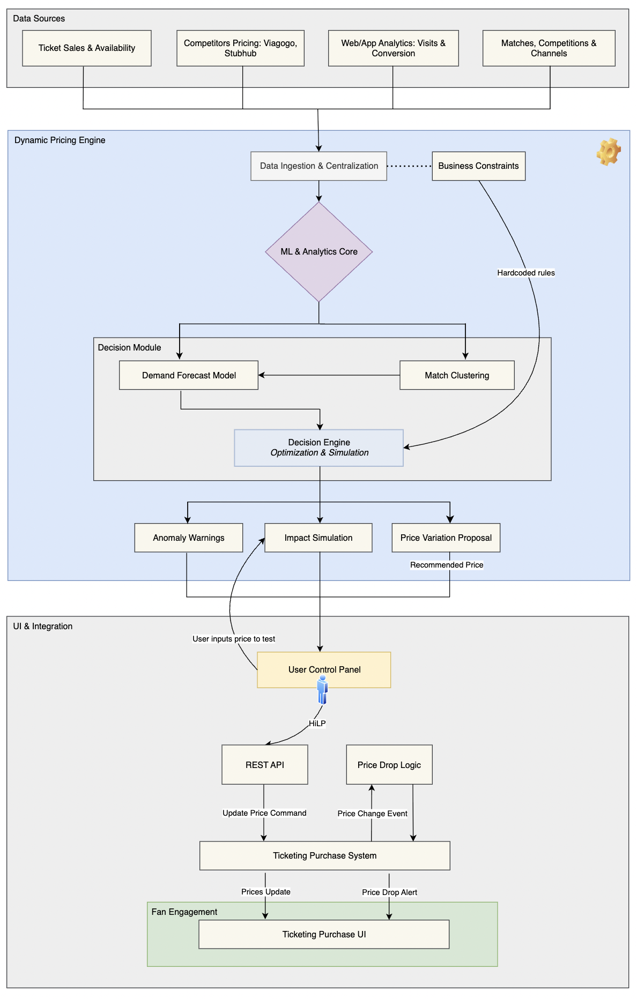

# 💹 FCB_Dynamic-Pricing

<p align="left">
  
  
  
</p>

> A semi-automated pricing engine for football match tickets. **Objective:** To convert a manual price-decision process into a more automated one and improve analytics to make each price variation more precise, with the final goal of optimizing revenue and ticket sales.

### Outline
- [Key Results & Metrics](#key-results--metrics)
- [Project Overview](#project-overview)
- [Methodology](#methodology)
- [Tech Stack & Architecture](#tech-stack--architecture)
- [Project Structure](#project-structure)
- [Usage](#usage)

---

## Key Results & Metrics

| Metric                      | Result                               | Description |
| :-------------------------- | :----------------------------------- | :----------------------------------- |
| 📈 Revenue Uplift           | **+9%** Average Revenue per Match    | Achieved by dynamically adjusting prices to match real-time demand forecasts, capturing more value from high-demand matches. Validated via controlled A/B testing.|
| ⚙️ Operational Efficiency   | **7x improvement** in Time-to-Price-Change | Realized by automating the manual data aggregation and analysis pipeline. The system delivers price recommendations directly, shifting the team's focus from data work to strategic approval.|
| 🎯 Demand Forecast Accuracy | **86%** Accuracy (WAPE)              | The result of a model combining internal sales data with external signals. Sales predictions were highly reliable.|
| 🎟️ Optimized Sales          | **+6%** Increase in Ticket Sell-Through Rate | A direct result of modeling price elasticity. Didn't maximize revenue at the cost of empty seats; also improved occupancy, which affects atmosphere and in-stadium sales.|

## Project Overview
The diagram below illustrates the conceptual framework for the Dynamic Pricing project. At its core, the system sits between two main stakeholders, The Club and The Fan, each with opposing goals. The engine's purpose is to find an optimal balance by ingesting various data points, processing them, and providing data-driven answers to both sides. It essentially acts as the *brain* that determines ticket prices based on a range of real-time and historical information.

<p align="left">
  
</p>

The system operates in a continuous loop: the Dynamic Pricing Engine constantly ingests and analyzes both Internal Factors (like how many seats are left) and External Factors (like social media buzz). Based on this combined data, it generates a recommended price and a demand forecast. The Club uses these outputs to set the official ticket prices. The Fan, in turn, sees these prices and uses the system's guidance (e.g., price-drop alerts) to decide when to buy. This entire process creates a responsive, market-driven pricing strategy that is more sophisticated than a static, pre-set price list; this moves from a reactive, manual process to a proactive, automated one with human-in-the-loop (HiTL).


| 🚩 The Problem | 💡 The Solution |
| :--------------------------- | :---------------------------- |
| **Static Pricing**: Prices were set once per season in rigid, inflexible categories (e.g., A++, A, B). | **Dynamic Recommendations**: Generates price proposals for each seating zone based on real-time data analysis. |
| **Manual Adjustments**: The team would slowly analyze various metrics to manually propose price changes. | **Impact Simulation**: Instantly models the projected impact of any price change on revenue and ticket sales. |
| **Data Bottleneck**: Extracting data manually from fragmented systems was slow and operationally complex. | **Centralized Data**: Automatically aggregates all key data points—sales, web analytics, contextual data, etc.—into one place. |
| **Slow Implementation**: The process to act on a decision was manual and disconnected from the sales platform. | **Seamless Integration**: Allows for one-click approval on a dashboard, which triggers a price update to the live ticketing system via REST API. |

## Methodology

Our project's methodology drew heavily from academic research on dynamic pricing. We focused on two core predictive tasks, carefully balancing the trade-offs between model complexity and the need for stakeholder trust.

### Modeling and Prediction Strategy

| Predictive Task | Modeling Approach | Key Technology | Rationale for Choice |
| :--- | :--- | :--- | :--- |
| **Demand Prediction** | Forecast future ticket demand for each match. Optimized for **predictive accuracy**, accepting a 'black-box' nature. | `Prophet`, `TensorFlow` | Handles complex time-series patterns and non-linear relationships for the highest possible predictive accuracy. |
| **Price Recommendation** | Model price elasticity to recommend optimal prices. Optimized for **interpretability** to ensure business stakeholder trust. | `scikit-learn (Ridge Regression)` | A robust linear model whose coefficients are easily interpretable, ensuring stakeholder trust and explaining price drivers. |

All models were designed for **batch prediction**, running on a daily schedule. This approach was chosen as the optimal balance between computational cost and the business need for timely price updates, which did not require second-by-second changes.

### Feature Engineering
A key part of our strategy was to enrich our models with external data, a common gap in existing research.

* **🏠 Internal factors**: Utilized traditional data such as historical sales, opponent tier, days until the match, and real-time ticket availability percentage..
* **🌍 External factors**: Integrated novel real-time signals including social media sentiment, search engine trends, and competing city events to capture market dynamics.

> For a detailed description of the features in the synthetic dataset, please refer to the [Data Dictionary](reports/data-dictionary.md).

## Tech Stack & Architecture

* **Cloud & MLOps**: AWS, with Amazon SageMaker AI for model training and pipelines.

* **Languages & core libraries**: Python, SQL, Prophet & TensorFlow (for demand forecasting), scikit-learn (for match clustering), Pandas.

* **Architecture diagram**: The architecture is designed for a robust, human-in-the-loop workflow. Data from various internal and external sources is ingested and processed by the core ML models. The resulting proposals and simulations are then presented to the commercial team on a User Control Panel for final review and approval, which triggers the price update via a REST API.

<p align="left">
  
</p>

> For a detailed description of the diagram and its' components, please refer to the [Architecture Diagram](reports/architecture-diagram.md).

## Project Structure

```
FCB_Dynamic-Pricing/
├── .gitignore                     # Specifies files for Git to ignore.
├── LICENSE                        # Project license (MIT).
├── README.md                      # An overview of the project. <-- YOU ARE HERE
├── requirements.txt               # The requirements file for reproducing the analysis.
├── config.py                      # Configuration file for paths, parameters, etc.
├── assets/                        # Contains images and diagrams for the README.
├── data/                          #  Stores data related to the project.
│   ├── 01_raw/                    # The original, immutable data.
│   └── 02_processed/              # Processed and cleaned data ready for modeling.
├── models/                        # Stores trained model artifacts.
├── reports/                       # Contains explanatory documents.
│   ├── data-dictionary.md         # A detailed description of the dataset features.
│   └── architecture-diagram.md    # An explanation of the system architecture.
└── src/                           # Source code for the project.
    ├── __init__.py                # Makes src a Python package.
    ├── data/                      # Scripts for data ingestion and processing.
    │   └── make_dataset.py        # Script to generate the synthetic dataset.
    ├── models/                    # Scripts for model training and prediction.
    │   ├── train_price_model.py   # Script to train the price prediction model.
    │   ├── train_demand_model.py  # Script to train the demand prediction model.
    │   ├── predict_price.py       # Script to get a sample price prediction.
    │   └── predict_demand.py      # Script to get a sample demand prediction.
    └── features/                  # Scripts for feature engineering.
```

## Usage

### 🚀 Running the Pipeline
To run the project and see the full pipeline in action, follow these steps from your terminal.

1.  **Set up the environment** (only needed once):
    ```bash
    pip install -r requirements.txt
    ```

2.  **Generate the dataset:** This step is only needed once to create the synthetic data file.
    ```bash
    python -m src.data.make_dataset
    ```

3.  **Run the training pipelines:** This will create and save both the price and demand model artifacts in the `models/` directory.
    ```bash
    python -m src.models.train_price_model
    python -m src.models.train_demand_model
    ```
    *Note: The `build_features.py` script is now used for the EDA notebook. The final training pipelines handle data transformations internally.*

4.  **Run the prediction scripts (optional):** These scripts demonstrate how to use the saved models from the command line.
    ```bash
    # Get a sample price prediction
    python -m src.models.predict_price

    # Get a sample demand prediction
    python -m src.models.predict_demand
    ```

### Interpreting the Model's Output
The predicted price from the model is not a final command, but rather a powerful **baseline recommendation**. In the real-world application, this price is displayed on a `User Control Panel` for the commercial team. The workflow is designed to be **Human-in-the-Loop (HiTL)**, where the team uses this data-driven recommendation as a starting point for their own analysis.

### How the Simulation Works
The "Impact Simulation" feature is powered by the **Demand Forecast Model**. This model was trained to predict the number of tickets that will be sold based on a given price and other market conditions.

When a user enters a hypothetical price into the control panel, the system feeds this price into the demand model to get a sales forecast. It then calculates the projected revenue (`predicted sales × price`), giving the commercial team an instant preview of the potential outcome of their pricing decisions.

</br>

> ⚠️ **Project Disclaimer:**
>
> * **Illustrative Purpose:** This repository serves as a high-level demonstration of the project's architecture and methodology. Many implementation details and model complexities have been simplified for clarity.
> * **Synthetic Data:** The code runs on synthetic data, as the original data is proprietary and cannot be shared. The purpose is to demonstrate the modeling approach and engineering best practices of the real-world project.

<p align="center">© 🌐 2025 t.r.</p>
