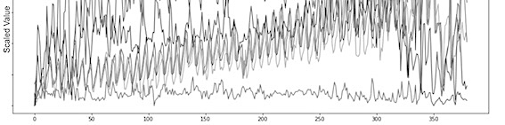
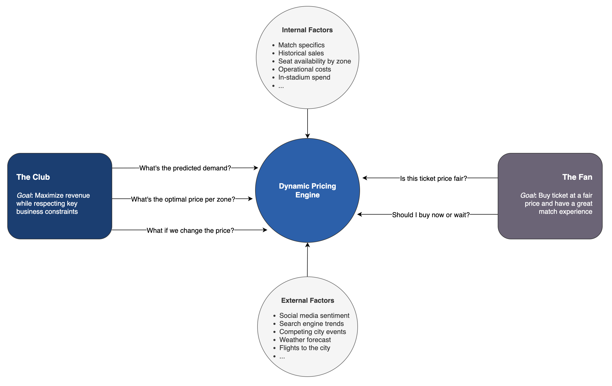

# Dynamic Pricing Engine with Human-in-the-loop

<p align="left">
  
  
</p>

> An ML-powered dynamic pricing and decision support system for tickets pricing in a sports stadium.
> **Objective:** To evolve a manual price-decision process into a data-driven, semi-automated workflow that improves ticketing revenue and sales by maximizing match-day revenue.

### Outline

- [Key Results](#key-results)
- [Overview](#overview)
- [Architecture](#architecture)
- [The System in Action](#the-system-in-action)
- [Dataset](#dataset)
- [Modeling](#modeling)
- [Structure](#structure)

---

## Key Results

| Metric                      | Result                              | Description |
| :-------------------------- | :---------------------------------- | :---------------------------------- |
| 📈 Revenue Uplift           | **+6%** Average Revenue per Match   | Achieved by dynamically adjusting prices to match real-time demand forecasts, capturing more value from high-demand periods. This was powered by accurate supply predictions from the `seat availability engine`. |
| ⚙️ Operational Efficiency   | **7x improvement** in Time-to-Price-Change | From weekly to daily changes by automating the manual data aggregation and analysis pipeline. The system delivered price recommendations directly, which shifted the team's focus from data work to strategic approval. |
| 🤝 Recommendation Adoption | **86%** of Proposals Approved       | Percentage of automated price proposals that were reviewed and approved by the commercial team, indicating trust in the model's business alignment. |

---

## Overview

The fundamental challenge was to find the optimal ticket price in a constantly changing environment. This required transforming a static, manual pricing strategy into a responsive, automated system with a human-in-the-loop (HiTL). The system needed to model the interplay between **sales velocity** (demand) and **inventory inflow** from season ticket holders (supply).

To achieve this, we engineered a three-part system: **predictive modeling**, an **adaptive optimization engine**, and a **real-time monitoring framework**.

<p align="center">
  
  <br>
  <em>Fig. 1: A standard stadium ticket pricing by zone during the checkout process.</em>
</p>

The core logic is the **Pricing Decision Framework**, a 2x2 matrix that translates supply and demand data into one of four distinct business strategies, ensuring every pricing decision is a deliberate response to real-time market conditions.

|             | **Low Supply** (Scarcity is high)                                                                                             | **High Supply** (Scarcity is low)                                                                                                                              |
| :---------- | :-------------------------------------------------------------------------------------------------------------------------- | :----------------------------------------------------------------------------------------------------------------------------------------------------------- |
| **High Demand** | **Quadrant 1: Margin Maximization** <br> _Scenario:_ A championship final with few seats left. <br> _Action:_ Increase price aggressively. | **Quadrant 2: Revenue Optimization** <br> _Scenario:_ A major weekend match with plenty of seats. <br> _Action:_ Maintain a strong price, nudging up if velocity is very high. |
| **Low Demand** | **Quadrant 3: Nudge to Close** <br> _Scenario:_ A mid-week match with few seats left, sales stalled. <br> _Action:_ Hold or slightly decrease price. | **Quadrant 4: Velocity Acceleration** <br> _Scenario:_ A rainy Tuesday match with thousands of empty seats. <br> _Action:_ Decrease price and activate promotions. |

<p align="center">
  
  <br>
  <em>Fig. 2: A high-level diagram of the system's market dynamics.</em>
</p>

---

## Architecture

<p align="center">
  
  <br>
  <em>Fig. 3: [System Context Diagram] Dynamic Pricing System</em>
</p>

### System Synergy
This Dynamic Pricing Engine is designed to work in tandem with the **[Seat Availability Engine](https://github.com/tomas-ravalli/fcb-smartbooking)**. The pricing model's effectiveness depends on knowing not just the current ticket availability, but the **final forecasted supply**. The Seat Availability Engine provides this crucial input, allowing this system to set prices based on a true understanding of the market's supply-demand curve.

---

## The System in Action

The team used the end-to-end system in three distinct phases.

### 1. Strategic Setup (Pre-Launch)
Weeks before tickets went on sale, the team set the initial strategy. They would input match details, and the system would generate a target **sell-through curve**. This curve represented the minimum sales velocity required to hit occupancy goals. They then used the engine's **simulation** capability to test opening prices and select the one that best balanced revenue and a strong sales start.

### 2. Dynamic Management (On-Sale Period)
Once tickets were on sale, the team's job shifted to supervision. Their daily focus was the **Monitoring Dashboard**, not the price itself. As long as the **Sell-Through Pace** was healthy, the system made small, automated price adjustments to optimize revenue without team intervention.

### 3. Alert-Driven Intervention
If the **Sell-Through Pace** dropped below target (a value below 1.0), an alert was triggered. The system would automatically recommend a corrective price drop. The team would review the recommendation, investigate the "why" using the **Demand Capture Rate**, and then either approve the change with one click or manually override it if a major, un-modeled event had occurred.

---

## Dataset

To showcase the model's capabilities, this repository uses a synthetically generated dataset engineered to mirror the complexity, scale, and statistical properties of a real-world ticketing environment.

A key part of the strategy was to enrich our models with external data. Through feature engineering, we created a comprehensive feature set by combining internal performance data with real-world market signals. The model's features are grouped into several categories to provide a holistic view of the factors influencing ticket demand.

| Category | Features | Description |
| :--- | :--- | :--- |
| **Product-Specific** | `days_until_match`, `is_weekday`, `opponent_tier`, `Match Excitement Factor`, `seat_zone` | Core details about the match, its timing, opponent quality, and seat location. |
| **Real-Time Market**| `social_media_sentiment`, `competitor_avg_price` | Live signals from the market, including social media and secondary ticket prices. |
| **Internal Demand** | `internal_search_trends`, `google_trends_index`, `web_visits`, `historical_market_spend` | Digital signals measuring public interest, search activity, and historical marketing impact. |
| **External Demand** | `is_holiday`, `flights_to_barcelona_index`, `hotel_reservation_trends` | Proxies for tourism and external factors that affect demand. |

---

## Modeling

The project is framed as a **constrained optimization problem**: find the optimal set of prices to maximize profit, subject to real-world business constraints.

The objective is to maximize the total profit ($Z$) for a given match, defined as:
```math
\max Z = \sum [\text{Ticket Revenue} + \text{In-Stadium Spend} - \text{Operational Costs} - \text{Distribution Costs} - \text{Marketing Spend}]
```
This maximization is subject to several key **constraints**:

1.  **Demand**: The number of tickets sold in each zone is a function of its price and other market factors, as predicted by our machine learning model.
2.  **Capacity and Inventory**: We cannot sell more tickets than the number of seats available in each zone.
3.  **Occupancy**: To protect brand image and comply with broadcast agreements, the primary seating zone visible on TV must have at least 85% occupancy.

This problem was modeled as a **single-objective problem with an adaptive policy**. Achieving minimum occupancy was a non-negotiable **constraint**, while maximizing revenue was the **objective**.

<p align="left">
  
  <br>
  <em>Fig. 4: Dynamic Pricing Engine component.</em>
</p>

### Stage 1: 📈 Demand & Supply Forecasting

This stage answers: *"At a given price, how many tickets are we likely to sell, and how many will be available?"*

| Aspect | Description |
| :--- | :--- |
| **Model** | A hybrid model using **Prophet** for the time-series baseline and **XGBoost** to model complex, non-linear factors and their interactions. A separate model forecasted inventory inflow from season ticket holders. |
| **Rationale** | This approach leverages Prophet's strength in modeling core time-series trends, while XGBoost captures the remaining variance using a rich feature set. Forecasting supply was crucial for selling virtual stock. |
| **Features** | The model uses a rich set of features–including product attributes, real-time market conditions, and internal/external demand signals–to build a comprehensive driver tree explaining demand. |

### Stage 2: ⚙️ Adaptive Optimization Engine

This engine determines the best price based on the strategy dictated by the Pricing Decision Framework.

| Aspect | Description |
| :--- | :--- |
| **Policies** | The engine operates with two primary policies: **Revenue Maximization** (default mode for Quadrants 1 & 2) and **Velocity Acceleration** (corrective mode for Quadrant 4). |
| **Process**| When in Revenue Maximization mode, the engine solves for the price that maximizes projected revenue. When in Velocity Acceleration mode (triggered by the monitoring framework), it solves for the minimum price needed to get back on track with occupancy goals. |
| **Output** | The engine's primary output is the official `Price Variation Proposal`, sent to the commercial team for review and approval. |

### The Monitoring Framework

To make the system actionable, a monitoring framework with a target **sell-through curve** was established as the benchmark for sales performance. The pricing team monitored a dashboard with three key metrics:

1.  **Sell-Through Pace:** `(Actual Sales / Target Sales)`. Gave an instant "are we on track?" signal. A value below 1.0 would trigger a switch to the 'Velocity Acceleration' policy.
2.  **Projected Days to Sell-Out:** `(Remaining Inventory / Current Sales Velocity)`. Answered, "If nothing changes, will we meet our goal?".
3.  **Demand Capture Rate:** `(Actual Velocity / Forecasted Velocity)`. An efficiency metric to diagnose *why* sales might be slow.

### Validation
The framework allowed us to run **simulations** to test the impact of business levers, such as the ROI of a marketing campaign, before committing resources.

We also engineered solutions to overcome business constraints. For example, since we couldn't A/B test prices directly due to EU regulations, we used **geo-targeting** to show or hide specific promotions to different markets. This allowed us to effectively segment customers and analyze price elasticity by market while respecting legal boundaries–a prime example of connecting data analysis to practical, real-world solutions.

---

## Structure

While most of the source code for this project is private, this section outlines the full structure. You can explore the synthetic data generation logic in `src/data/make_dataset.py` to see how the realistic environment was simulated.

```bash
FCB_Dynamic-Pricing/
├── .gitignore                        # (Public) Specifies files for Git to ignore.
├── LICENSE                           # (Public) Project license.
├── README.md                         # (Public) This project overview.
├── requirements.txt                  # (Private) The requirements file for the full project.
├── config.py                         # (Private) Configuration file for paths and parameters.
├── assets/                           # (Public) Diagrams and images for documentation.
├── data/
│   └── 03_synthetic/
│       └── synthetic_match_data.csv  # (Public) The generated synthetic dataset.
├── models/                           # (Private) Stores trained model artifacts.
│   ├── demand_forecast_model.joblib
│   └── feature_pipeline.joblib
├── notebooks/                        # (Private) Jupyter notebooks for analysis.
│   └── eda.ipynb
└── src/
    ├── __init__.py                   # (Private) Makes src a Python package.
    ├── data/
    │   └── make_dataset.py           # (Public) The script to generate the synthetic data.
    ├── features/                     # (Private) Scripts for feature engineering.
    │   └── build_features.py
    ├── models/                       # (Private) Scripts for model training and prediction.
    │   ├── train_demand_model.py
    │   └── predict_demand.py
    └── dynamic_pricing_engine/       # (Private) Scripts for simulation and optimization.
        ├── constants.py
        ├── simulate.py
        └── optimize.py
```

</br>

> [!WARNING]
> * **Data:** The data in this repository is synthetically generated for demonstration purposes and it may not mirror the statistical properties of the original dataset.
> * **Complexity:** This repository provides a high-level demonstration of the project's architecture and methodology. Certain implementation details and model complexities have been simplified for clarity.

</br>

<p align="center">🌐 © 2025 t.r.</p>
