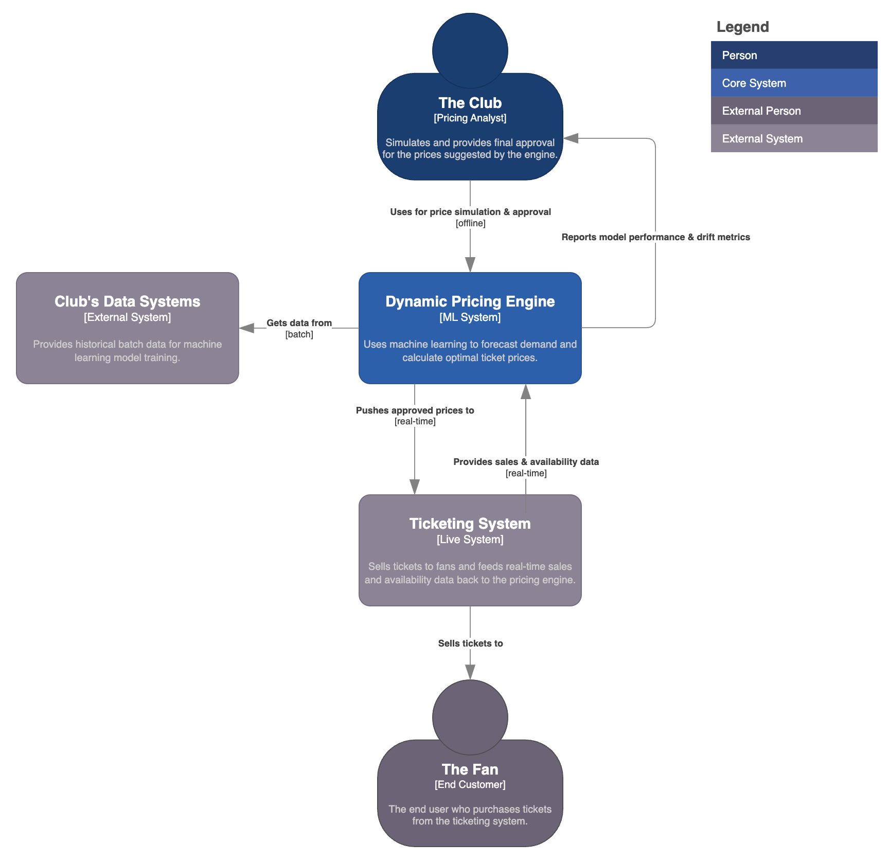

# Dynamic Pricing Engine with Human-in-the-loop

<p align="left">
  
</p>

> An ML-powered dynamic pricing and decision support system for tickets pricing in a sports stadium. 
> **Objective:** To evolve a manual price-decision process into a data-driven, semi-automated workflow that improves ticketing revenue and sales.

### Outline

- [Key Results](#key-results)
- [Overview](#overview)
- [Architecture](#architecture)
- [Dataset](#dataset)
- [Modeling](#modeling)
- [Usage](#usage)
- [Structure](#structure)

---

## Key Results

| Metric                      | Result                               | Description |
| :-------------------------- | :----------------------------------- | :----------------------------------- |
| 📈 Revenue Uplift           | **+6%** Average Revenue per Match    | Achieved by dynamically adjusting prices to match real-time demand forecasts, capturing more value from high-demand periods. This was powered by accurate supply predictions from the `seat availability engine` [](https://github.com/tomas-ravalli/seat-availability-engine) |
| 🎟️ Optimized Sales          | **+4%** Increase in Ticket Sell-Through Rate | Didn't maximize revenue at the cost of empty seats: also improved occupancy, which positively affects atmosphere and in-stadium sales.|
| ⚙️ Operational Efficiency   | **7x improvement** in Time-to-Price-Change | From weekly to daily changes by automating the manual data aggregation and analysis pipeline. The system delivered price recommendations directly, which shifted the team's focus from data work to strategic approval.|
| 🤝 Recommendation Adoption | **86%** of Proposals Approved | Percentage of automated price proposals that were reviewed and approved by the commercial team, indicating trust in the model's business alignment.|
| 🎯 Demand Forecast Accuracy | **19%** WAPE | The model's predictions had a low average error, performed 60% better than a baseline `DummyRegressor`, indicating that sales forecasts are reliable.|


## Overview

The main challenge was to transform a static, manual pricing strategy into a responsive, automated system. The fundamental challenge was to find the optimal price in a constantly changing environment by modeling the interplay between sales velocity (demand from fans) and inventory inflow (supply from season ticket holders).

It's also relevant to understand the market structure we operated in. We had a near-monopoly, with no direct substitutes for attending a live match. Our only competition came from a non-official secondary market of resellers. This gave us significant pricing power but also the responsibility to price fairly to protect the brand.

<p align="center">
  
  <br>
  <em>Fig. 1: A standard stadium ticket pricing by zone during checkout process.</em>
</p>

To illustrate how the system directly addresses key business challenges, the following table maps each identified pain point to its corresponding solution:

| 🚩 The Problem | 💡 The Solution |
| :--------------------------- | :---------------------------- |
| **Static pricing**: Prices were set once per season in rigid, inflexible categories (e.g., A++, A, B), then updated weekly/monthly. | **Dynamic recommendations**: Generates price proposals for each seating zone based on near real-time data analysis, allowing for daily updates. |
| **Manual adjustments**: The team would slowly analyze various metrics to manually propose price changes. | **Impact simulation**: Instantly models the projected impact of any price change on revenue and ticket sales. |
| **Data bottleneck**: Extracting data manually from fragmented systems was slow and operationally complex. | **Centralized data**: Automatically aggregates all key data points–sales, web analytics, contextual data, etc.–into one place. |
| **Slow implementation**: The process to act on a decision was manual and disconnected from the sales platform. | **Seamless integration**: Allows for one-click approval on a dashboard, which triggers a price update to the live ticketing system via REST API. |


## Architecture

<p align="center">
  
  <br>
  <em>Fig. 2: [System Context Diagram] Dynamic Pricing System</em>
</p>

### System Synergy
This Dynamic Pricing Engine is designed to work in tandem with the **[Seat Availability Engine](https://github.com/tomas-ravalli/seat-availability-engine)**. The pricing model's effectiveness depends on knowing not just the current ticket availability, but the **final forecasted supply**. The Seat Availability Engine provides this crucial input by predicting when season ticket holders will release their seats, allowing this system to set prices based on a true understanding of the market's supply-demand curve.


## Dataset

The model was trained on a time-series dataset with zone-level granularity, capturing daily records of how demand, sales, and availability evolve from the day tickets go on sale until match day. The model was enriched with external data, combining historical performance with real-world market signals to create a more holistic and predictive view.

| Category | Features | Description |
| :--- | :--- | :--- |
| **Match & Opponent** | `match_id`, `days_until_match`, `is_weekday`, `opponent_tier`, `ea_opponent_strength`, `international_competition` | Core details about the match, its timing, and opponent quality. Includes the 'Match Excitement Factor'. |
| **Team Status** | `team_position`, `top_player_injured`, `league_winner_known` | Captures the team's current performance, player status, and league context. |
| **Ticket & Zone** | `seat_zone`, `ticket_price`, `ticket_availability_pct`, `zone_seats_availability` | Attributes related to the specific ticket and seating area. |
| **Demand & Hype** | `internal_search_trends`, `google_trends_index`, `social_media_sentiment`, `web_visits`, `web_conversion_rate`, `competitor_avg_price` | Digital signals measuring public interest, purchase intent, and secondary market conditions. |
| **External Factors**| `is_holiday`, `popular_concert_in_city`, `flights_to_barcelona_index` | External events and tourism proxies (flight and hotel booking data) that affect demand. |
| **Weather** | `weather_forecast` | Forecasted weather conditions for the match day. |

> **`zone_historical_sales`** [Target Variable]: The historical number of tickets sold for a similar match in that specific zone. This is the value the model aims to predict.

## Modeling

We engineered a multi-layered system to tackle the pricing problem:
- Stage 1: **Value-based Pricing Strategy**
- Stage 2: **Demand Forecasting**
- Stage 3: **Adaptive Optimization Layer**.

<p align="left">
  
  <br>
  <em>Fig. 4: Dynamic Pricing Engine component.</em>
</p>

### Stage 1: Value-Based Pricing Strategy

Before any dynamic adjustments, we established a strategic **Value-Based Pricing** layer. This was a manual framework designed to capture consumer surplus from the start. It operated on two principles:

* **Tiered product offering:** We created 'good-great-best' versions of our products (e.g., Basic, Basic Plus, and VIP tickets).
* **Customer segmentation:** We identified customer segments with a higher willingness to pay. Using macroeconomic data like GDP and inflation rates, we would show more expensive, higher-value tiers by default to users from richer countries.

This layer set the **starting price** and the **product menu**. It ensured we weren't offering a €75 ticket to someone already willing to pay €150. The dynamic engine then operated *on top* of this strategic foundation.

### Stage 2: Demand Forecasting

This stage answers the business question: *"At a given price, how many tickets are we likely to sell?"*

| Aspect | Description |
| :--- | :--- |
| **Model** | A hybrid **ensemble model** that combines `Prophet` and `XGBoost` in a residual fitting approach. |
| **Rationale** | This two-step model leverages the strengths of both algorithms. **Prophet** first models the core time-series components (trend, seasonality, and match-day effects). **XGBoost** then models the remaining variance (the residuals) using a rich feature set, capturing complex interactions that Prophet cannot. |
| **Features** | The model uses a rich set of internal and external factors–including historical sales, opponent tier, social media sentiment, and other engineered features–to build a comprehensive **"driver tree"** that explains demand. |
| **Application** | This trained model powers the *Impact Simulation* feature, allowing the commercial team to perform "what-if" analysis by inputting a hypothetical price and instantly seeing the likely impact on revenue and sales. |
| **Design Choice** | A hybrid model was chosen after testing multiple approaches, as the optimal forecasting method is never known beforehand. This ensemble was selected for its superior accuracy; it combines Prophet's strength in modeling core time-series trends with XGBoost's power to capture the remaining complex patterns, leading to a lower overall error. |
| **Production Trade-offs** | The chosen model provides the best balance between **prediction accuracy**, **serving speed** (latency), and **inference cost**, ensuring strong performance in a live environment. |

<details>
<summary><b>Click to see the detailed model performance evaluation</b></summary>
  
</br>

To ensure the final pricing decision is effective, the underlying demand forecast must be highly accurate. The primary goal was to minimize prediction error, evaluated against a **baseline model** (`DummyRegressor`). The key metric chosen was **WAPE**, as it provides a clear, interpretable measure of percentage error.

Determining the best forecasting method is only one half of the equation. We also need to estimate **prediction intervals**–the upper and lower forecast values that the actual value is expected to fall between with a high probability. Prediction intervals are a function of how much data we have, the variation in that data, the forecast horizon, and the chosen model. They are crucial for risk assessment.

As this project uses a hybrid ensemble model, performance is evaluated on the **final, combined forecast**. The system first generates a baseline forecast with `Prophet`, then uses `XGBoost` to predict the remaining error (residuals). The final prediction (`Prophet forecast + XGBoost error forecast`) is then compared against the actual historical sales to derive the metrics below.

| Metric | Value | Rationale |
| :--- | :--- | :--- |
| **WAPE** (Primary Metric) | **19%** | **Why we chose it:** Weighted Absolute Percentage Error tells us the average forecast error in percentage terms, making it highly interpretable for revenue planning. A low WAPE is our main goal. |
| **R² Score** | **0.83** | **For model fit:** This shows that the model explains 83% of the variance in ticket sales, confirming it has a strong statistical fit to the data and learns the underlying patterns effectively. |
| **Mean Absolute Error (MAE)** | **~254 tickets**| **For business context:** MAE tells us that, on average, our forecast is off by about 254 tickets. This gives stakeholders a concrete sense of the error margin in absolute units. |
| **Root Mean Squared Error (RMSE)**| **~312 tickets**| **For robustness & uncertainty:** RMSE penalizes larger errors more heavily. A higher RMSE relative to MAE suggests the model occasionally makes larger prediction errors. This is critical for risk assessment and for estimating **prediction intervals** to understand the forecast's range of uncertainty. |

The performance was considered **successful**. A WAPE of 19% and an R² of 0.83 demonstrated a robust and reliable forecasting engine.

</details>

### Stage 3: Adaptive Optimization Layer

The goal is not just to build a black-box forecasting model, but to solve a formal business problem. At its core, this project can be framed as a **constrained optimization problem**: we want to find the optimal set of prices to maximize profit, subject to real-world business constraints.

The objective is to maximize the total profit ($Z$) for a given match, defined as:

````math
\max Z = \underbrace{\sum_{j=1}^{n} (p_j \cdot S_j)}_{\text{Ticket Revenue}} + \underbrace{(\bar{m} \cdot \sum_{j=1}^{n} S_j)}_{\text{In-Stadium Spend}} - \underbrace{C_{total}}_{\text{Total Costs}}
````

Where the terms in the equation are defined as:

* **$n$** is the number of distinct seating zones.
* **$p_j$** is the ticket price for zone *j*. This is the **decision variable**–the set of values we are solving for.
* **$S_j$** is the number of tickets sold in zone *j* at price $p_j$. This is an outcome predicted by the demand model, where $S_j = f(p_j, \mathbf{X})$.
* **$\mathbf{X}$** is the vector of features for the match (e.g., opponent tier, days until match).
* **$\bar{m}$** is the average in-stadium spend per attendee, estimated from historical data.
* **$C_{total}$** is the sum of all operational, distribution, and marketing costs for the match.

This maximization is subject to several key **constraints**:

1.  **Demand**: The number of tickets sold ($S_j$) in each zone is a function of its price ($p_j$) and other market factors ($\mathbf{X}$), as predicted by our machine learning model.
2.  **Capacity and Inventory**: We cannot sell more tickets than the number of seats available ($C_j$) in each zone.
3.  **Occupancy**: To protect brand image and comply with broadcast agreements, the primary seating zone visible on TV ($j_{tv}$) must have at least 85% occupancy.

This stage answers the business question: *"What is the single best price to maximize total revenue?"*

| Aspect | Description |
| :--- | :--- |
| **Model** | A custom *Optimization Engine* that performs an exhaustive grid search over a range of valid prices. |
| **Rationale** | A grid search is a reliable and straightforward method to find the optimal price within defined business constraints (e.g., price caps and floors). It guarantees finding the maximum projected revenue. |
| **Process** | The engine iterates through potential prices (e.g., from €75 to €350), uses the demand model to predict sales for each, calculates the projected revenue `(Price × Predicted Sales)`, and returns the optimal price. |
| **Output** | The engine's primary output is the official `Price Variation Proposal`, which is sent to the commercial team for review and approval. |
| **Design Choice**| A key design choice was to model this as a **single-objective problem with an adaptive policy**, rather than a more complex multi-objective problem. We treated achieving minimum occupancy as a non-negotiable **constraint**, while maximizing revenue was the **objective**. This simplifies the problem while still allowing the system to react to different market conditions. |

## Usage

The core logic of the system was our **Pricing Decision Framework**. It's a 2x2 matrix that translates the raw numbers of supply and demand into concrete business strategy, ensuring every pricing decision was a deliberate response to real-time market conditions.

| | **Low Supply** | **High Supply**|
| :--- | :--- | :--- |
| **High Demand** | **Quadrant 1: Margin Maximization** <br> _Scenario:_ A championship final with few seats left. <br> _Action:_ Increase price aggressively to capture maximum value. | **Quadrant 2: Revenue Optimization** <br> _Scenario:_ A major weekend match with plenty of seats. <br> _Action:_ Maintain a strong, stable price. |
| **Low Demand** | **Quadrant 3: Nudge to Close** <br> _Scenario:_ A mid-week match with few seats left, but sales have stalled. <br> _Action:_ Hold or slightly decrease price. | **Quadrant 4: Velocity Acceleration** <br> _Scenario:_ A rainy Tuesday match with thousands of empty seats. <br> _Action:_ Decrease price and activate promotions. |

This framework directly informed the two primary policies of our optimization engine:
* **Policy 1: Revenue Maximization (default mode):** Active in Quadrants 1 and 2, when the occupancy constraint was not at risk. The engine's objective was to find the price that maximized projected revenue.
* **Policy 2: Velocity Acceleration (corrective mode):** Triggered in Quadrant 4, when the monitoring framework showed the occupancy constraint was in danger. The engine's objective function would then switch to satisfying the constraint: it solved for the minimum price to get back on track.

### Monitoring

To make the system actionable, it first generated a target **sell-through curve** for each match. This curve represented the minimum sales velocity required each day to hit our occupancy goals. 'Slow' was never an absolute number; it was a deviation from this forecast. The pricing team monitored this via a dashboard with a key metric: **Sell-Through Pace:** `(Actual Sales / Target Sales)`. This gave an instant 'are we on track?' signal. A value below 1.0 would trigger the switch to the 'Velocity Acceleration' policy.

## Structure

While most of the source code for this project is private, this section outlines the full structure. You can explore the synthetic data generation logic in `src/data/make_dataset.py` to see how the realistic environment was simulated.

```bash
FCB_Dynamic-Pricing/
├── .gitignore                          # (Public) Specifies files for Git to ignore.
├── LICENSE                             # (Public) Project license.
├── README.md                           # (Public) This project overview.
├── requirements.txt                    # (Private) The requirements file for the full project.
├── config.py                           # (Private) Configuration file for paths and parameters.
├── assets/                             # (Public) Diagrams and images for documentation.
├── data/
│   └── match_data.csv                  # (Private) The match dataset.
├── models/                             # (Private) Stores trained model artifacts.
│   ├── demand_forecast_model.joblib
│   └── feature_pipeline.joblib
├── notebooks/                          # (Private) Jupyter notebooks for analysis.
│   └── eda.ipynb
└── src/
    ├── __init__.py                     # (Private) Makes src a Python package.
    ├── features/                       # (Private) Scripts for feature engineering.
    ├── models/                         # (Private) Scripts for model training and prediction.
    │   ├── train_demand_model.py
    │   └── predict_demand.py
    └── dynamic_pricing_engine/         # (Private) Scripts for simulation and optimization.
        ├── constants.py
        ├── simulate.py
        └── optimize.py
```

</br>

> [!WARNING]
> This repository provides a high-level demonstration of the project's architecture and methodology. Certain implementation details and model complexities have been simplified for clarity.

</br>

<p align="center">🌐 © 2025 t.r.</p>
